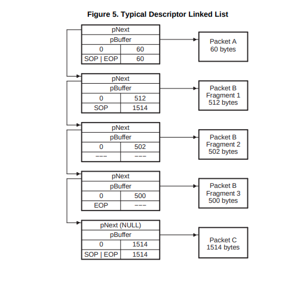

== DM6446 EMAC

MAC(MII)控制器驱动，PHY(MDIO)驱动

https://www.ti.com.cn/cn/lit/pdf/sprue24[DMSoC EMAC DS]

Table 25. Ethernet Media Access Controller (EMAC) Registers

.buffer描述表

=== 裸机驱动

link:pic/emac_test.c[emac_test]

=== Linux NIC驱动

https://github.com/analogdevicesinc/linux/blob/2018_R1/drivers/net/ethernet/ti/davinci_emac.c[k4.9 emac驱动]

