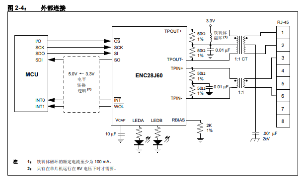
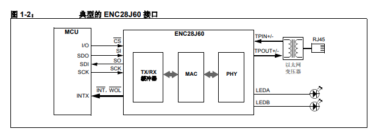
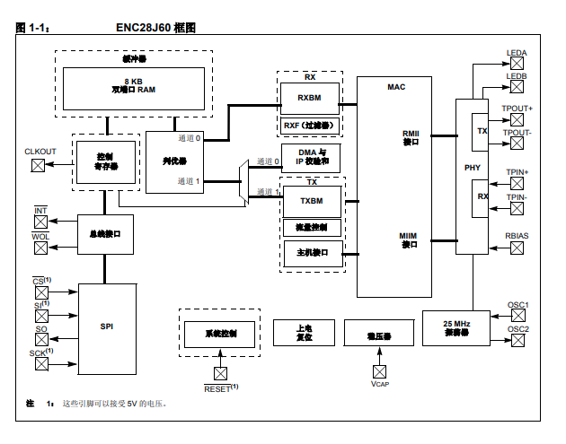
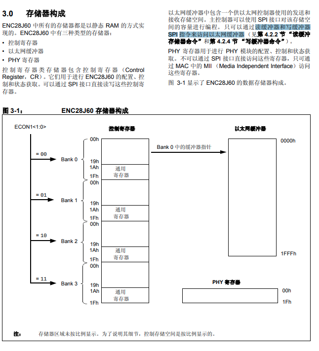

== ENC28J60

http://www.microchip.com.cn/newcommunity/Uploads/Download/Library/39662a_cn.pdf[ENC28J60 datasheet]

=== no-os
https://blog.csdn.net/mcu_tian/article/details/49786375[LwIP在stm32上的无操作系统移植(ENC28J60)]

=== Linux

https://github.com/analogdevicesinc/linux/blob/2018_R1/drivers/net/ethernet/microchip/enc28j60.c[drivers/net/ethernet/microchip/enc28j60.c]

==== 发送代码分析

[source,c]
----
/* buffer的地址划分 */
#define TXSTART_INIT		0x1A00
#define TXEND_INIT		0x1FFF

/* Put RX buffer at 0 as suggested by the Errata datasheet */
#define RXSTART_INIT		0x0000
#define RXEND_INIT		0x19FF

static void
enc28j60_packet_write(struct enc28j60_net *priv, int len, const u8 *data)
{
	......
#define ENC28J60_WRITE_BUF_MEM	0x7A

	/* write per-packet control byte */
	spi_write_op(priv, ENC28J60_WRITE_BUF_MEM, 0, 0x00);
	spi_write_buf(priv, len, data);
}

static int spi_write_buf(struct enc28j60_net *priv, int len,
			 const u8 *data)
{
	int ret;

#define MAX_FRAMELEN		1518
#define SPI_TRANSFER_BUF_LEN	(4 + MAX_FRAMELEN)

	if (len > SPI_TRANSFER_BUF_LEN - 1 || len <= 0)
		ret = -EINVAL;
	else {
		priv->spi_transfer_buf[0] = ENC28J60_WRITE_BUF_MEM;
		memcpy(&priv->spi_transfer_buf[1], data, len);

		ret = spi_write(priv->spi, priv->spi_transfer_buf, len + 1);
		......
	}
	return ret;
}

static void enc28j60_hw_tx(struct enc28j60_net *priv)
{
	......
	enc28j60_packet_write(priv, priv->tx_skb->len, priv->tx_skb->data);
	/* set TX request flag */
	locked_reg_bfset(priv, ECON1, ECON1_TXRTS);

}
----

==== 接收代码分析

https://github.com/analogdevicesinc/linux/blob/2018_R1/drivers/net/ethernet/microchip/enc28j60.c#L1120-L1233[enc28j60_irq_work_handler]

https://github.com/analogdevicesinc/linux/blob/2018_R1/drivers/net/ethernet/microchip/enc28j60.c#L1098-L1118[enc28j60_rx_interrupt]

https://github.com/analogdevicesinc/linux/blob/2018_R1/drivers/net/ethernet/microchip/enc28j60.c#L904-L1009[enc28j60_hw_rx]

[source,c]
----

	/* priv->next_pk_ptr中保存着RX buffer的地址，将RX地址开头8个字节读到rsv中 */
	/* 字节0字节1存放的是 RX buffer中下个package的地址*/
	/* 字节2字节3存放的是 这个pkg的长度 */
	/* 字节4字节6存放的是 这个pkg的状态标识 */
	enc28j60_mem_read(priv, priv->next_pk_ptr, sizeof(rsv), rsv);

----

https://github.com/analogdevicesinc/linux/blob/2018_R1/drivers/net/ethernet/microchip/enc28j60.c#L962-L980[接收数据到skb]