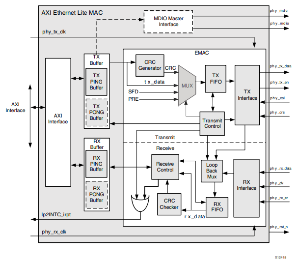
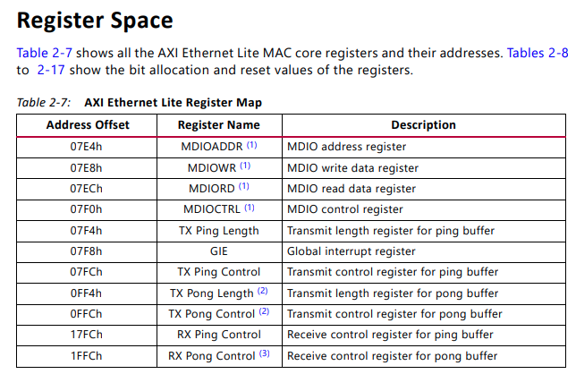
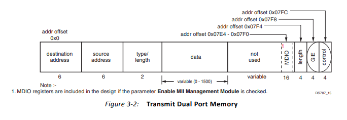
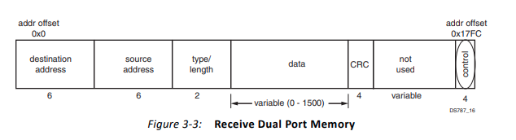

== Xilinx Ethernet Lite MAC

.Block Diagram of the AXI Ethernet Lite MAC

.AXI Ethernet Lite Register Map

0x07E4前面的地址是ping pong buffer的地址空间

=== Bare metal driver

==== TX代码分析

.TX memory

SendFrame->XEmacLite_Send->XEmacLite_AlignedWrite,XEmacLite_WriteReg

[source,c]
----
static int SendFrame(XEmacLite *XEmacInstancePtr, u32 PayloadSize)
{
	u8 *FramePtr;
	int Index;
	int Status;

	/*
	 * Set the Complete flag to false.
	 */
	TransmitComplete = FALSE;

	/*
	 * Assemble the frame with a destination address and the source address.
	 */
	FramePtr = (u8 *)TxFrame;
	*FramePtr++ = LocalAddress[0];
	*FramePtr++ = LocalAddress[1];
	*FramePtr++ = LocalAddress[2];
	*FramePtr++ = LocalAddress[3];
	*FramePtr++ = LocalAddress[4];
	*FramePtr++ = LocalAddress[5];

	/*
	 * Fill in the source MAC address.
	 */
	*FramePtr++ = LocalAddress[0];
	*FramePtr++ = LocalAddress[1];
	*FramePtr++ = LocalAddress[2];
	*FramePtr++ = LocalAddress[3];
	*FramePtr++ = LocalAddress[4];
	*FramePtr++ = LocalAddress[5];

	/*
	 * Set up the type/length field - be sure its in network order.
	 */
	*((u16 *)FramePtr) = Xil_Htons(PayloadSize);
	FramePtr++;
	FramePtr++;

	/*
	 * Now fill in the data field with known values so we can verify them
	 * on receive.
	 */
	for (Index = 0; Index < PayloadSize; Index++) {
		*FramePtr++ = (u8)Index;
	}

	/*
	 * Now send the frame.
	 */
	Status = XEmacLite_Send(XEmacInstancePtr, (u8 *)TxFrame,
			    PayloadSize + XEL_HEADER_SIZE);

	return  Status;
}
----

==== RX代码分析

.RX memory

irq->XEmacLite_Recv

https://github.com/Xilinx/embeddedsw/blob/master/XilinxProcessorIPLib/drivers/emaclite/src/xemaclite.c#L338-L468[XEmacLite_Recv]

=== Linux driver

==== TX代码分析

如果Emaclite Tx缓冲区忙，停止TX队列并使用中断推迟skb到中断服务程序中的传输，直到当前传输完成。

https://github.com/analogdevicesinc/linux/blob/2018_R1/drivers/net/ethernet/xilinx/xilinx_emaclite.c#L1012[emaclite tx]

==== RX代码分析

https://github.com/analogdevicesinc/linux/blob/2018_R1/drivers/net/ethernet/xilinx/xilinx_emaclite.c#L584[xemaclite_rx_handler]

读取XEL_RSR_OFFSET检查状态

https://github.com/analogdevicesinc/linux/blob/2018_R1/drivers/net/ethernet/xilinx/xilinx_emaclite.c#L371[xemaclite_recv_data]