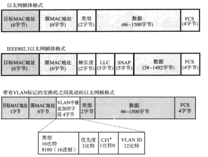
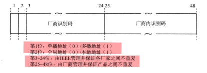
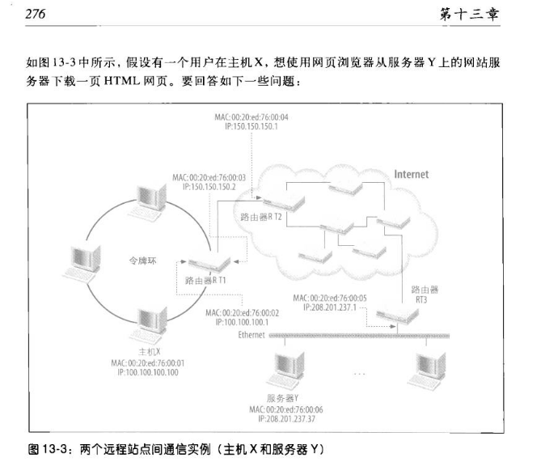
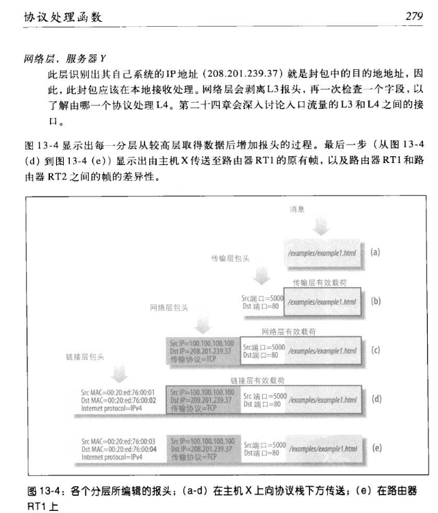
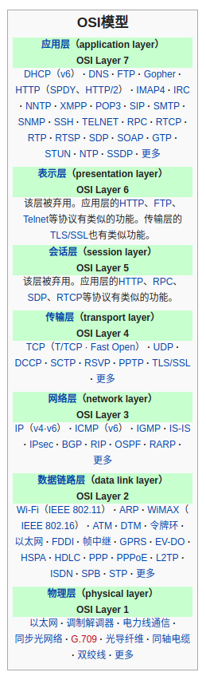
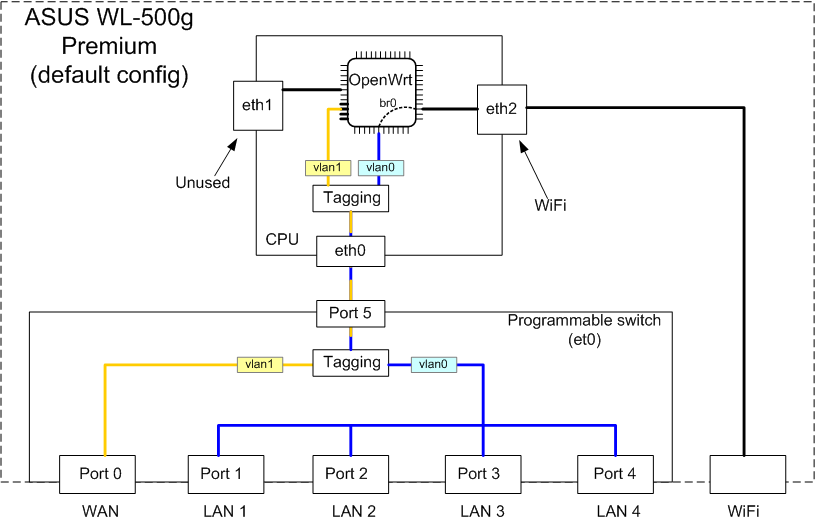

== 以太网 Overview

=== MAC 帧

IP数据加上IP的帧头，得到IP帧，IP帧再加上MAC帧头的格式得到MAC帧。
但IP帧不限制长度，如果超过1500，需要IP数据分包。

.MAC帧
[#img-sunset]

=== MAC 地址

.MAC地址格式

.MAC地址格式

.MAC地址格式

MAC驱动分析

ENC28J60: buffer为纯IP数据，不含MAC地址，MAC地址需要预先设置
XMACLITE: ping pong buffer 描述表，

== 通常硬件层次模型

OSI 网络7层模型，为什么分层？层可替换型，L3以上基本都是软件行为，各种协议组合起来称为协议栈，大量的应用使用TCP/IP协议栈来容纳。

[[img-sunset]]

----

+---------------+
|CPU            |
|       +-------+        +--------+
|       | MDIO/ +--------+        |
|       |SFPI2C |        |        |
|       +-------+        |   PHY  |
|       | MAC   |        |        +-------------+
|       | MII/  |        |        |             |
|       | RGMII/+--------+        |             |
|       | GMII/ |        |        |             |
|       | RGMII/|        |        |             |
|       | SGMII |        |        |             |
|       +-------+        +--------+             |
|               |                               |铜(1000BASE-TX)/ 
+---------------+                               |光(1000BASE-SX)/
                                                |...
+---------------+                               |
|CPU            |                               |
|       +-------+        +--------+             |
|       | MDIO/ +--------+        |             |
|       |SFPI2C |        |        |             |
|       +-------+        |   PHY  |             |
|       | MAC   |        |        |             |
|       | MII/  |        |        |             |
|       | RGMII/+--------+        +-------------+
|       | GMII/ |        |        |
|       | RGMII/|        |        |
|       | SGMII |        |        |
|       +-------+        +--------+
|               |
+---------------+

----

----
+---------+
|         |
|         +---+ zynq gem0
|         +---+ t3k cpu0 mac
| 88E6321 +---+ t3k cpu1 mac
|         +---+ RJ45
|         +---+ SFP x 2
|         |
+---------+

----

https://zh.wikipedia.org/wiki/%E5%90%89%E6%AF%94%E7%89%B9%E4%BB%A5%E5%A4%AA%E7%BD%91[物理层标准定义]

.路由器内部框图

[source,console]
----
$ ifconfig
br-lan    Link encap:Ethernet  HWaddr 20:76:93:4C:FA:0F  
          inet addr:192.168.1.1  Bcast:192.168.1.255  Mask:255.255.255.0
          inet6 addr: fd1a:3070:9436::1/60 Scope:Global
          inet6 addr: fd1a:3070:9436:4::1/62 Scope:Global
          inet6 addr: fe80::2276:93ff:fe4c:fa0f/64 Scope:Link
          UP BROADCAST RUNNING MULTICAST  MTU:1500  Metric:1
          RX packets:2796 errors:0 dropped:0 overruns:0 frame:0
          TX packets:353 errors:0 dropped:0 overruns:0 carrier:0
          collisions:0 txqueuelen:1000 
          RX bytes:394456 (385.2 KiB)  TX bytes:74882 (73.1 KiB)

eth0      Link encap:Ethernet  HWaddr 20:76:93:4C:FA:0F  
          inet6 addr: fe80::2276:93ff:fe4c:fa0f/64 Scope:Link
          UP BROADCAST RUNNING MULTICAST  MTU:1500  Metric:1
          RX packets:4141 errors:0 dropped:0 overruns:0 frame:0
          TX packets:1217 errors:0 dropped:0 overruns:0 carrier:0
          collisions:0 txqueuelen:1000 
          RX bytes:698525 (682.1 KiB)  TX bytes:178515 (174.3 KiB)
          Interrupt:21 

eth0.1    Link encap:Ethernet  HWaddr 20:76:93:4C:FA:0F  
          UP BROADCAST RUNNING MULTICAST  MTU:1500  Metric:1
          RX packets:2873 errors:0 dropped:14 overruns:0 frame:0
          TX packets:353 errors:0 dropped:0 overruns:0 carrier:0
          collisions:0 txqueuelen:1000 
          RX bytes:404034 (394.5 KiB)  TX bytes:74882 (73.1 KiB)

eth0.2    Link encap:Ethernet  HWaddr 20:76:93:4C:FA:11  
          inet addr:192.168.0.116  Bcast:192.168.0.255  Mask:255.255.255.0
          inet6 addr: fd1a:3070:9436::610/128 Scope:Global
          inet6 addr: fd1a:3070:9436:4::610/128 Scope:Global
          inet6 addr: fd1a:3070:9436:4:2276:93ff:fe4c:fa11/64 Scope:Global
          inet6 addr: fe80::2276:93ff:fe4c:fa11/64 Scope:Link
          inet6 addr: fd1a:3070:9436:0:2276:93ff:fe4c:fa11/64 Scope:Global
          UP BROADCAST RUNNING MULTICAST  MTU:1500  Metric:1
          RX packets:1174 errors:0 dropped:0 overruns:0 frame:0
          TX packets:841 errors:0 dropped:0 overruns:0 carrier:0
          collisions:0 txqueuelen:1000 
          RX bytes:208597 (203.7 KiB)  TX bytes:89376 (87.2 KiB)

lo        Link encap:Local Loopback  
          inet addr:127.0.0.1  Mask:255.0.0.0
          inet6 addr: ::1/128 Scope:Host
          UP LOOPBACK RUNNING  MTU:65536  Metric:1
          RX packets:2229 errors:0 dropped:0 overruns:0 frame:0
          TX packets:2229 errors:0 dropped:0 overruns:0 carrier:0
          collisions:0 txqueuelen:1000 
          RX bytes:352935 (344.6 KiB)  TX bytes:352935 (344.6 KiB)

wlan0     Link encap:Ethernet  HWaddr 20:76:93:4C:FA:0E  
          inet6 addr: fe80::2276:93ff:fe4c:fa0e/64 Scope:Link
          UP BROADCAST RUNNING MULTICAST  MTU:1500  Metric:1
          RX packets:0 errors:0 dropped:0 overruns:0 frame:0
          TX packets:1689 errors:0 dropped:0 overruns:0 carrier:0
          collisions:0 txqueuelen:1000 
          RX bytes:0 (0.0 B)  TX bytes:357258 (348.8 KiB)
----

=== 网桥

https://www.cnblogs.com/clpszpp/p/linux_bridge.html[Linux网桥介绍]

https://blog.51cto.com/13465487/2374960[将Linux拥有交换机的网桥功能]

https://www.cnblogs.com/nathaninchina/articles/2682575.html[Linux 下的双网卡桥接]

https://www.cnblogs.com/bakari/p/10529575.html[Linux 虚拟网络设备详解之 Bridge 网桥]

https://wiki.phytec.com/pages/viewpage.action?pageId=123699246[在linux下配置网桥 / how to config ethernet bridge under linux]

=== TUN/TAP

https://www.jianshu.com/p/09f9375b7fa7[TUN/TAP设备浅析(一) -- 原理浅析]

== 经典MAC控制器分析

MAC（Media Access Control）

|===
|芯片/控制器 |内容

|ENC28J60 |http://www.microchip.com.cn/newcommunity/Uploads/Download/Library/39662a_cn.pdf[ENC28J60 DS]

|DM6446 EMAC| https://www.ti.com.cn/cn/lit/pdf/sprue24[DMSoC EMAC DS]

|Xilinx Ethernet Lite MAC |info 6

|Xilinx AXI Ethernet | info 5
|===

include::ENC28J60.adoc[ENC28J60]

include::LITEMAC.adoc[LITEMAC]

include::DMSOCEMAC.adoc[DMSOCEMAC]

include::AXIETH.adoc[AXIETH]

